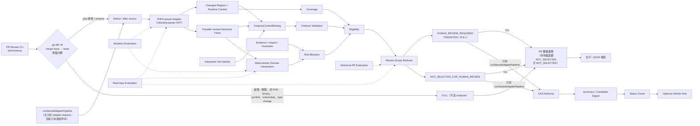
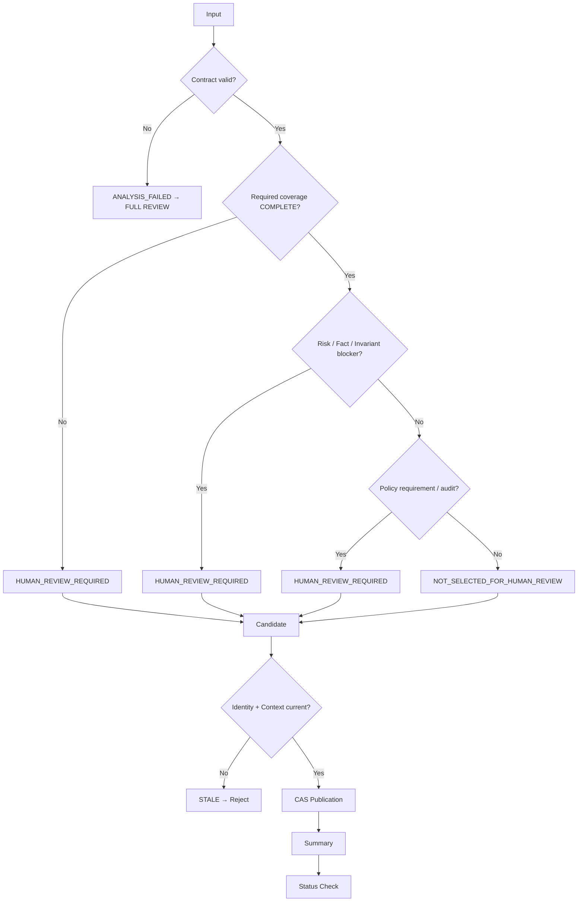

# Review Reduction Safety MVP 架構與流程

本文記錄 Review Decision Engine 目前的架構、安全邊界與 production seams。

目前系統已不只是 fixture-only Safety MVP；已接入第一個真實 PHP/Laravel executable Adapter（nikic/php-parser AST analyzer）、versioned domain interpreters、PR 層級的 review CLI（`bin/review.js`）、Mutation Evaluation、Real-repo Evaluation 與 Historical PR Evaluation。

## 1. 系統架構



圖中有兩條使用 pipeline 結果的路徑：

- **PR Review CLI**（`bin/review.js`）：與 GitHub PR 相同，比較 head 相對於 `git merge-base <base> <head>` 的變更。每個送進 analyzer 的檔案各自走一次 Adapter → Interpreters → Reducer，所有變更檔案再彙整成 PR 層級決策。analysis identity 的 `baseSha` 是 merge base；報表的 `base.sha` 仍是 `--base` 指向的 commit，另以 `mergeBase` 標出比較起點。
  - 只有 `.php` 的修改與 rename 會送進 analyzer；新增、刪除、非 PHP、binary、symlink、submodule 與 type change 一律 `FULL`。analyzer process 失敗（找不到 `php`、逾時、非 0 結束、輸出不是 JSON）時該檔也是 `FULL`（`ANALYZER_ERROR:<訊息>`）。
  - rename（`FILE_RENAMED`）與權限變更（`FILE_MODE_CHANGED`）即使內容等價也要求 review：原本 `NOT_SELECTED_FOR_HUMAN_REVIEW` 的檔案改為 `TARGETED`；其他經 analyzer 分析的檔案在原因後加上適用的代碼（`TARGETED` / `FULL` 不變）。沒有分析結果就判為 `FULL` 的檔案（上一點不送 analyzer 的檔案，以及 `BINARY_FILE`、`ANALYZER_ERROR`）不會加上。
  - PR 層級只有在**所有**檔案都是 `NOT_SELECTED_FOR_HUMAN_REVIEW` 時才是 `NOT_SELECTED_FOR_HUMAN_REVIEW`。
  - 每個檔案使用 in-memory authority state，不寫入 CAS store，也不發布到 GitHub。
  - 用法、merge base 語意、選項、exit code、原因代碼與文字 / JSON 報表見 [PR Review CLI](review-cli.md)。
- **Stored pipeline**（`runStoredAdapterPipeline`）：CAS Authority → Summary / Candidate Digest → Status Check → optional GitHub Sink。輸入是注入的 adapter 與 adapter request，不經過 CLI 的 git diff 與逐檔分類；CLI 的結果也不會進入這條路徑。GitHub transport 需注入；目前只有測試呼叫，沒有 CLI 或 workflow 使用。

圖中的 evaluation（虛線）也不經過 CLI 的 git diff 步驟：harness 直接把 before / after source 交給 Adapter，以 in-memory authority state 執行 pipeline。

`TARGETED` / `FULL` 的判定見 §5。reduction 是 file-level：`TARGETED` 列出的原因與位置只是 review 的起點，整個檔案仍需 review。

## 2. Analysis Context Binding

Authoritative result 不只綁 base/head SHA。

目前 context binding 包含：

```
adapterSetDigest
executionContextDigest
semanticFactsDigest
interpreterSetDigest
```

因此下列任一項改變，都不能重用舊 authoritative result：

- Adapter set/version。
- runtime / changed-region context。
- semantic fact payload。
- interpreter id/version。

這是 stale-safe 與 auditability 的核心。

## 3. PHP/Laravel Adapter

Node process 透過 PHP CLI 執行 analyzer（`analyzers/php/bin/analyze.php`），以 stdin 傳入 path 與 before / after source，讀回 JSON。Adapter 只輸出 changed region（整個 head 檔案）、runtime context、coverage obligation `COV-PHP-001` 與 facts，不產生 review decision。

Analyzer 以 [nikic/php-parser](https://github.com/nikic/PHP-Parser) 5.9.0（版本鎖定於 `analyzers/php/composer.lock`）解析 AST。執行 analyzer 需要 PATH 上的 `php`（PHP CLI ≥ 8.3，`analyzers/php/composer.json` 的要求；CI 使用 8.4），依賴以 `npm run analyzer:install`（Composer 2）安裝。這是執行 analyzer 的 PHP 版本，與被分析專案的目標版本無關。被分析的程式碼以最新語法或 PHP 7.4 語法解析，判為等價前只檢查 PHP 7 與 PHP 8 的解讀，PHP 5 的語意不在檢查範圍。解析方式：

- 被分析的程式碼先以最新 PHP 語法解析；任一側失敗時 before / after 一起改用 PHP 7.4 語法（`#[` 視為註解，與 PHP 7 相同）。
- PHP 7.4 語法下仍有任一側無法解析時回報 `PHP_PARSE_ERROR`。

只有 AST 中每個差異都對應到一個 fact 時才允許 `COMPLETE`（`StructuralDiff`）：

- 排版、註解、trailing comma、引號種類、`array()` / `[]`、多餘括號不算差異（`Canonicalizer` 的 hash 不看 node attributes）；`__LINE__` 的行號與 `__COMPILER_HALT_OFFSET__` 則納入比較。
- 其餘每個被「解釋」的差異都必須消耗一個 call fact 或產生一個新的 fact，因此沒有 fact 的 `COMPLETE` 只會發生在兩棵 AST 相同時（區域變數以 canonical 名稱比較，見下）。
- 位置參數的改變無法被更細的 fact 解釋時，會輸出 `CALL_ARGUMENT_CHANGED`（argument 為 `#index`）作為補充資訊，但不算已解釋。

比對最多依序做三輪。後一輪只在前面各輪都留有未解釋差異時才執行，且只有能完整解釋時才採用，否則維持第 1 輪的結果：

1. 以原始變數名稱比較。
2. 以 scope-aware canonical 名稱比較（`VariableScopes`）：method / function 內一致的區域變數改名視為等價。參數、`$this`、superglobal、`global` 變數與頂層變數不改名；scope 內有 `compact`、`extract`、`get_defined_vars`、`$$x`、`eval`、`include` / `require` 等以字串存取變數名的機制時，整個 scope 不做改名正規化（完整條件見 [README「已實作」](../README.md#已實作)）。
3. 以原始名稱比較，並把變數差異描述成 `VARIABLE_CHANGED`（部分改名、合併變數、參數改名等）。

判為等價（`COMPLETE` 且沒有 fact）前，再以最新語法與 PHP 7.4 語法分別解析 before / after：同一語法下兩側的可解析性必須一致，兩側都能解析的語法下也必須等價，否則回報 `PHP_GRAMMAR_DIVERGENCE`（例如 `.` 與 `+` 的優先順序在 PHP 8 改變）。舊版 PHP 不支援的新語法（例如參數 trailing comma）不在這項檢查範圍內，請以目標 PHP 版本的 `php -l` 檢查。PHP 5 的語意也不在檢查範圍：例如 `$$foo['bar']` 在 PHP 5 是 `${$foo['bar']}`，在 PHP 7 / 8 是 `${$foo}['bar']`，兩者互換會被判為等價。

目前輸出 13 種 generic facts（各 fact 的細節與 container 格式見 [README「已實作」](../README.md#已實作)）：

- `CallExtractor` / `CallFacts`：`CALL_ARGUMENT_CHANGED`（named argument）、`CALL_REMOVED` / `CALL_ADDED`（method、nullsafe method 與 static call，含 closure 內的巢狀 call 與鏈式 call）。
- `StructuralDiff`：`BINARY_OPERATOR_CHANGED`、`GUARD_REMOVED` / `GUARD_ADDED`、`ARRAY_ITEM_REMOVED` / `ARRAY_ITEM_ADDED`、`LITERAL_CHANGED`、`EXPRESSION_NEGATED`、`RETURN_VALUE_CHANGED`、`CALL_ARGUMENTS_REORDERED`、`VARIABLE_CHANGED`。

下列情況 analyzer 回報 `PARTIAL_PARSE`，`COV-PHP-001` 帶 reasonCode：

```
UNRECOGNIZED_PHP_CHANGE   有差異無法被目前支援的 fact 解釋
PHP_GRAMMAR_DIVERGENCE    原本判為等價，但 PHP 8 與 PHP 7 的解讀不一致
```

Analyzer 回傳 `ok: false` 時，Adapter 把 `COV-PHP-001` 設為 `FAILED`：

```
PHP_PARSE_ERROR                   最新語法與 PHP 7.4 語法都無法解析 before / after
PHP_ANALYZER_DEPENDENCY_MISSING   缺少 Composer 依賴（analyzers/php/vendor），先執行 npm run analyzer:install
PHP_ANALYZER_INPUT_INVALID        輸入不合法（防禦性檢查）
```

head 版本是空檔時，Adapter 不執行 analyzer，`COV-PHP-001` 為 `UNSUPPORTED`（`PHP_FILE_DELETION_UNSUPPORTED`）。analyzer process 本身失敗（找不到 `php`、逾時、非 0 結束、輸出不是 JSON）時 `analyze()` 會 reject：adapter runner 把它轉成 `ADAPTER_EXCEPTION` / `ADAPTER_EXECUTION_TIMEOUT`（`ANALYSIS_FAILED`），PR Review CLI 則直接把該檔列為 `ANALYZER_ERROR:<訊息>`。

上述情況都保留 Human Review（`FULL`）。這些代碼在 CLI 輸出中的樣子見 [PR Review CLI「原因代碼」](review-cli.md#原因代碼)。

## 4. Domain Interpreter Boundary

Adapter 只說「發生什麼」。

Interpreter 才說「這件事對 Review policy 代表什麼」。

目前 `PHP_LARAVEL_DOMAIN_INTERPRETERS`（`src/interpreters/php-laravel-domain.js`）註冊 15 個 interpreter。比對 callee 前會先移除 fully-qualified 前導 `\`，所以 `\DB::transaction` 與 `DB::transaction` 相同。例如：

```
CALL_ARGUMENT_CHANGED（named argument idempotencyKey）
→ PAYMENT_IDEMPOTENCY_IDENTITY_CHANGED
```

```
CALL_REMOVED（DB receiver 的 transaction / commit，或任何 receiver 的 beginTransaction）
→ TRANSACTION_BOUNDARY_REMOVED
```

```
CALL_REMOVED（$this->authorize、$this->authorizeForUser、Gate::authorize）
→ AUTHORIZATION_GUARD_REMOVED
```

其餘：

- 上面的 transaction interpreter 也處理 rollback 被移除（`TRANSACTION_ROLLBACK_REMOVED`），authorization interpreter 也處理 ability 字串改值（`AUTHORIZATION_ABILITY_CHANGED`）。
- 另外三個 domain interpreter：middleware guard、row lock、payment signature verification。
- 七個 generic interpreter：operator change（`BINARY_OPERATOR_CHANGED`）、guard clause（`GUARD_REMOVED` / `GUARD_ADDED`）、negation（`EXPRESSION_NEGATED`）、return value（`RETURN_VALUE_CHANGED`）、argument order（`CALL_ARGUMENTS_REORDERED`）、variable change（`VARIABLE_CHANGED`）、constant value（`const` 宣告值的 `LITERAL_CHANGED`）。
- 兩個 Laravel interpreter：validation rules、model attributes（`$fillable` / `$guarded`、`$hidden` / `$visible`、`$casts` / `casts()`）。

一個 fact 可以被多個 interpreter 處理，例如 `rules()` 的整個回傳值換成常數或從常數換掉（`RETURN_VALUE_CHANGED` fact，如 `return self::RULES;` → `return [];`）時，同時產生 `RETURN_VALUE_CHANGED` 與 `VALIDATION_RULE_CHANGED`；只改陣列內的規則（`LITERAL_CHANGED`、`ARRAY_ITEM_*`，如 `'required'` 改成 `'nullable'`）時只產生 `VALIDATION_RULE_CHANGED`。完整清單見 [README「已實作」](../README.md#已實作)，每個輸出代碼的意義見 [PR Review CLI「Domain 原因代碼」](review-cli.md#domain-原因代碼)。

Interpreter 必須有穩定 `id/version`，並被納入 `interpreterSetDigest`。

未知 fact 不得靜默消失：

```
FACT_UNHANDLED:<fact-id>
```

`FACT_UNHANDLED` 仍要求 Human Review。它本身不會讓 fallback 變成 `FULL`（不屬於 `COV-` / `COVERAGE_` / `ANALYZER_` 開頭的代碼，見 §5）：coverage 完整、每個變更都已被 fact 解釋時，原因只有 `FACT_UNHANDLED` 的檔案是 `TARGETED`；同一檔案有 `COV-PHP-001:*` 時仍是 `FULL`。例如位置參數的 fallback `CALL_ARGUMENT_CHANGED`（§3）沒有 interpreter 處理時會產生 `FACT_UNHANDLED`，但它只在有差異無法解釋時輸出，檔案一定帶 `COV-PHP-001:UNRECOGNIZED_PHP_CHANGE`，因此是 `FULL`。Interpreter 丟出例外或回傳不合法結果時產生 `ANALYZER_FACT_INTERPRETER_FAILED` / `ANALYZER_FACT_INTERPRETER_INVALID_RESULT` blocker（`FULL`）。

## 5. Decision Flow



`HUMAN_REVIEW_REQUIRED` 帶有 fallback（`src/reducer.js`）：

- `FULL`：分析失敗（`ANALYSIS_FAILED`），或 blocker 中有 `COV-`、`COVERAGE_`、`ANALYZER_` 開頭的代碼（coverage obligation 未完整、analyzer 或 interpreter 錯誤）。PHP 檔有變更無法以 fact 解釋時就是這種情況（`COV-PHP-001:UNRECOGNIZED_PHP_CHANGE`）。
- `TARGETED`：coverage 完整，只剩 fact / domain blocker（含 `FACT_UNHANDLED`）或 policy / audit 要求，也就是每一處變更都已被具體 fact 解釋。

兩者都是 file-level 決策。`TARGETED` 不代表只需看標示的行：原因與位置是 review 的起點，整個檔案仍需 review。

## 6. 核心安全規則

1. `NOT_SELECTED_FOR_HUMAN_REVIEW` 只能來自完整且有效分析。
2. Unknown != Safe。
3. Required coverage 未完整時不得 reduction。
4. `PARTIAL_PARSE`、unsupported、timeout、truncation、analyzer failure 都保留 Human Review。
5. Adapter 不得直接產生 Review decision。
6. Unhandled semantic fact 不得被忽略。
7. Fact properties 必須 deterministic JSON-safe。
8. Facts 與 interpreter identity 都屬於 analysis context。
9. 新 head SHA 立即使舊結果 stale。
10. Late old run 不得覆寫 current result。
11. Candidate / Summary / Status Check 必須使用相同 identity/context。
12. GitHub sink 只負責 delivery，不得改寫 safety decision。
13. Mutation critical false negative 必須使 evaluation gate 失敗。
14. Historical human concern 若落在未選取檔案，evaluation gate 必須失敗。
15. Real-repo evaluation 中 risky mutation 被 reduce（`RISKY_REDUCED`）必須使 gate 失敗。
16. PR 層級只有在所有變更檔案都是 `NOT_SELECTED_FOR_HUMAN_REVIEW` 時才能 reduction；沒有送進 analyzer 的檔案與 rename / 權限變更一律要求 review。
17. `TARGETED` 不得被解讀成只需 review 標示的位置；reduction 是 file-level。

## 7. 核心模組

| 模組 | 檔案 | 責任 |
|---|---|---|
| Contract | `src/contracts.js` | Identity、coverage、eligibility、decision validation |
| Adapter Contract | `src/adapters/contracts.js` | AdapterSet、runtime、facts/interpreter context digests |
| PHP/Laravel Adapter | `src/adapters/php-laravel/adapter.js` | PHP CLI execution、AdapterResult、analyzer 失敗轉成 fail-closed obligation |
| PHP Analyzer | `analyzers/php/bin/analyze.php` | 入口：檢查 Composer 依賴、選擇語法（最新 / PHP 7.4）、三輪比對、PHP 7 / 8 交叉檢查、輸出 facts 與 completeness |
| PHP Analyzer classes | `analyzers/php/src/*` | `CallExtractor`（AST method / static call 抽取）、`CallFacts`（call facts）、`StructuralDiff`（AST 結構比對、completeness 判定與結構性 facts）、`Canonicalizer`（忽略排版、註解等的 canonical AST hash）、`VariableScopes`（scope-aware 區域變數 canonical 名稱） |
| Fact Contract | `src/facts/contracts.js` | Fact validation、JSON-safe canonicalization |
| Fact Interpreter | `src/facts/interpreter.js` | versioned interpreter boundary、fail-closed handling |
| PHP/Laravel Rules | `src/interpreters/php-laravel-domain.js` | 15 個 deterministic domain interpreters |
| Coverage | `src/coverage.js` | required obligations |
| Evidence / Impact / Invariants | `src/{evidence,impact,invariants}.js` | unresolved fact blockers |
| Reducer | `src/reducer.js` | eligibility aggregation、review scope decision（`TARGETED` / `FULL`） |
| Runner | `src/runner.js` | full pipeline |
| Publication | `src/publication.js` | stale protection、authority publication |
| Storage | `src/storage/*` | memory / SQLite CAS |
| Summary | `src/summary.js` | candidate digest、status check |
| GitHub Sink | `src/integrations/github/*` | provider-neutral delivery |
| PR Review CLI | `bin/review.js` | 參數解析、文字 / JSON 輸出、exit code |
| PR Review | `src/review/{git,review,format}.js` | merge base 與 `git diff`、逐檔分類與 pipeline、rename / 權限變更、PR 層級彙整、行號提示、文字報表 |
| Mutation Eval | `evaluation/mutations/*` | controlled safety/reduction benchmark |
| Real-repo Eval | `evaluation/real-repo/*` | 在真實 PHP 專案產生帶標籤的 mutation（`generate.php`）、執行完整 pipeline、gate 與 `--baseline-ref` 比較 |
| Historical Eval | `evaluation/historical/*` | offline PR concern recall benchmark |

## 8. Evaluation

Release gate：

```bash
npm run analyzer:install   # 第一次需要安裝 PHP analyzer 依賴
npm run test:all
```

`test:all` 依序執行 lint（ESLint，只檢查 JS）、safety tests、E2E、coverage、mutation evaluation、historical evaluation。需要 PATH 上的 `php`（PHP CLI ≥ 8.3）與 Composer 2；沒有安裝依賴時 analyzer 以 `PHP_ANALYZER_DEPENDENCY_MISSING` fail-closed，release gate 無法通過。

CI（`.github/workflows/review-reduction-safety.yml`，Node.js 24、PHP 8.4）在 `npm ci` 之後先執行 `composer install --working-dir=analyzers/php`，再對 `analyzers/php/bin`、`analyzers/php/src` 與 `evaluation` 下的 `.php` 檔執行 `php -l`，最後執行 `npm run test:all`。

Mutation baseline（`npm run eval:mutations`，20 cases：16 critical、4 safe）：

```
Critical Recall               100.0%
False Negative Rate             0.0%
Critical Direct Fact Coverage 100.0%
Safe Reduction Rate           100.0%
Partial Coverage Rate          15.0%
Analysis Failure Rate           0.0%
Full Review Fallback Rate      15.0%
```

Real-repo evaluation：

`npm run eval:real-repo -- evaluate --repo <label>=<path> ...` 在真實 PHP 專案的檔案上自動產生帶標籤的 mutation（`unchanged` / `safe` / `risky`），走完整 pipeline（PHP analyzer → interpreters → reducer），再檢查決策是否符合標籤；`--baseline-ref <ref>` 可與修改前的版本比較。Gate 任一項不為 0 即失敗（exit code 1）：

- `RISKY_REDUCED`：risky mutation 被判為 `NOT_SELECTED_FOR_HUMAN_REVIEW`（漏判，最嚴重）。
- `ANALYZER_ERROR`：analyzer crash、逾時或 pipeline 例外。
- `UNCHANGED_NOT_REDUCED`：可解析的未變更檔案沒有被 reduce（generator 判定 `parseable: false` 的檔案除外，含空檔）。
- `NO_ROWS_ANALYZED` / `REPO_NOT_ANALYZED`：沒有任何一筆被實際分析，或多個 repo 時某個 repo 沒有任何一筆被實際分析。

最近一次在本機對兩個私有 PHP 金流專案與一個 Laravel 11 專案執行（seed 42、rate 0.3，共 12,283 筆：3,093 unchanged、3,648 safe、5,542 risky）：

```
Risky reduced (must be 0)    0
Risky targeted rate          99.3%
Risky specific reason rate   53.4%
Safe reduction rate          100.0%
Unchanged reduction rate     99.9%
```

未被 reduce 的 3 筆 unchanged 都是空檔（`parseable: false`）。目標專案不在本 repo 內，這些數字無法只靠本 repo 重現。對真實目標專案執行的 Real-repo evaluation 不在 `npm run test:all` 與 CI 中，不屬於 release gate，是修改 analyzer / interpreter 後在本機執行的驗證（`npm run test:all` 只以 `tests/evaluation/real-repo-cli.test.js` 在 repo 內的 `fixtures/php-laravel` 上執行 `evaluate`，測試工具本身與 gate）；資料是自動產生的 mutation，不是真實 PR。說明見 [Real-repo Evaluation](../evaluation/real-repo/README.md)。

Historical CI pilot：

```
Human Concern Recall          100.0%
Review Scope Reduction         33.3%
Analysis Failure Rate           0.0%
Full Review Rate                0.0%
```

Historical pilot 是 controlled fixture（1 個 case、3 個檔案），不是 production benchmark。

## 9. 與 Agent Work Harness

Reviewer 不負責判斷 agent work 是否完成。

建議：

```
Codex / Claude Code
        ↓
Agent Work Harness
        ↓
Verification SUCCESS
        ↓
Reviewer
        ↓
Review Scope Plan
        ↓
Human / AI Reviewer
```

詳細 contract 與 integration roadmap：

[Agent Work Harness Integration](integrations/agent-work-harness.md)

## 10. 後續方向

優先：

1. 真實 Historical PR corpus（目前只有 1 個 controlled fixture pilot）。
2. 增加 PHP/Laravel support，降低 `PARTIAL_PARSE`。
3. 提高 risky 變更的具體原因比例（real-repo 的 Risky specific reason rate 目前 53.4%，其餘只有 `FACT_UNHANDLED` 等 generic 原因），並減少仍為 `FULL` 的情況。Safe Reduction Rate 在 mutation corpus 與 real-repo 都已是 100.0%，但 safe 案例只涵蓋排版、註解、引號、trailing comma、區域變數改名等變更；真實 PR 的 reduction 需以第 1 項的 corpus 衡量。
4. 正式的 Review Scope Plan：可安裝的 `reviewer plan` 指令，以及有版本的 JSON schema（`schemaVersion`、`reviewScope`、metrics、Reviewer 版本與 analysis identity），見 [Agent Work Harness Integration](integrations/agent-work-harness.md) §5。`bin/review.js` 已提供 PR 層級的逐檔決策與位置提示，但只能以 `node bin/review.js` 呼叫，`--json` 報表也沒有 schema 版本，不是該文件提案的 Review Scope Plan 格式。
5. Harness `review <workId>` integration。
6. GitHub PR Review Scope workflow（目前 CI 只在測試中執行 `bin/review.js`，不會用它 review PR；GitHub sink 也沒有 workflow 使用）。
7. region-level blocker → fact → provenance contract。在此之前，`TARGETED` 的位置只是 review 起點。
8. optional impact provider，例如 code-review-graph。
9. LLM 僅作 hypothesis / explanation，不取得 reduction authority。
