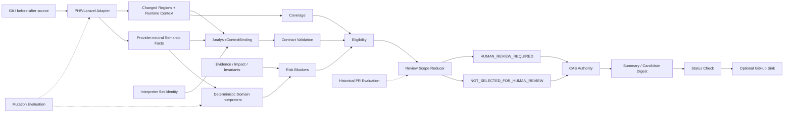
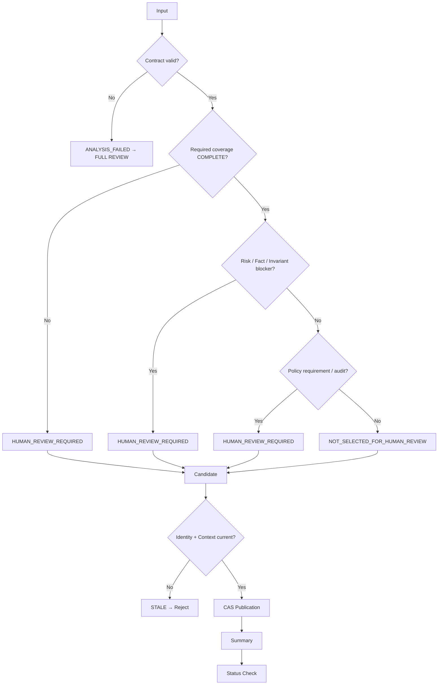

# Review Reduction Safety MVP 架構與流程

本文記錄目前已合入 `master` 的 Review Decision Engine 架構、安全邊界與 production seams。

目前系統已不只是 fixture-only Safety MVP；已接入第一個真實 PHP/Laravel executable Adapter、versioned domain interpreters、Mutation Evaluation 與 Historical PR Evaluation。

## 1. 系統架構



## 2. Analysis Context Binding

Authoritative result 不只綁 base/head SHA。

目前 context binding 包含：

```
adapterSetDigest
executionContextDigest
semanticFactsDigest
interpreterSetDigest
```

因此下列任一項改變，都不能重用舊 authoritative result：

- Adapter set/version。
- runtime / changed-region context。
- semantic fact payload。
- interpreter id/version。

這是 stale-safe 與 auditability 的核心。

## 3. PHP/Laravel Adapter

Node process 透過 PHP CLI 執行 analyzer。

Analyzer 使用：

```php
token_get_all($source, TOKEN_PARSE)
```

目前輸出 generic facts：

- `CALL_ARGUMENT_CHANGED`
- `CALL_REMOVED`
- `CALL_ADDED`

只有在 analyzer 能證明目前支援的 semantic transformation 足以解釋 significant token change 時才允許 `COMPLETE`。

否則：

```
PARTIAL_PARSE
UNRECOGNIZED_PHP_CHANGE
```

並保留 Human Review。

## 4. Domain Interpreter Boundary

Adapter 只說「發生什麼」。

Interpreter 才說「這件事對 Review policy 代表什麼」。

目前第一批 rules：

```
idempotencyKey argument changed
→ PAYMENT_IDEMPOTENCY_IDENTITY_CHANGED
```

```
DB::transaction removed
→ TRANSACTION_BOUNDARY_REMOVED
```

```
authorize removed
→ AUTHORIZATION_GUARD_REMOVED
```

Interpreter 必須有穩定 `id/version`，並被納入 `interpreterSetDigest`。

未知 fact 不得靜默消失：

```
FACT_UNHANDLED:<fact-id>
```

## 5. Decision Flow



## 6. 核心安全規則

1. `NOT_SELECTED_FOR_HUMAN_REVIEW` 只能來自完整且有效分析。
2. Unknown != Safe。
3. Required coverage 未完整時不得 reduction。
4. `PARTIAL_PARSE`、unsupported、timeout、truncation、analyzer failure 都保留 Human Review。
5. Adapter 不得直接產生 Review decision。
6. Unhandled semantic fact 不得被忽略。
7. Fact properties 必須 deterministic JSON-safe。
8. Facts 與 interpreter identity 都屬於 analysis context。
9. 新 head SHA 立即使舊結果 stale。
10. Late old run 不得覆寫 current result。
11. Candidate / Summary / Status Check 必須使用相同 identity/context。
12. GitHub sink 只負責 delivery，不得改寫 safety decision。
13. Mutation critical false negative 必須使 evaluation gate 失敗。
14. Historical human concern 若落在未選取檔案，evaluation gate 必須失敗。

## 7. 核心模組

| 模組 | 檔案 | 責任 |
|---|---|---|
| Contract | `src/contracts.js` | Identity、coverage、eligibility、decision validation |
| Adapter Contract | `src/adapters/contracts.js` | AdapterSet、runtime、facts/interpreter context digests |
| PHP/Laravel Adapter | `src/adapters/php-laravel/adapter.js` | PHP CLI execution、AdapterResult |
| PHP Analyzer | `analyzers/php/bin/analyze.php` | token-level semantic extraction |
| Fact Contract | `src/facts/contracts.js` | Fact validation、JSON-safe canonicalization |
| Fact Interpreter | `src/facts/interpreter.js` | versioned interpreter boundary、fail-closed handling |
| PHP/Laravel Rules | `src/interpreters/php-laravel-domain.js` | deterministic domain blockers |
| Coverage | `src/coverage.js` | required obligations |
| Evidence / Impact / Invariants | `src/{evidence,impact,invariants}.js` | unresolved fact blockers |
| Reducer | `src/reducer.js` | eligibility aggregation、review scope decision |
| Runner | `src/runner.js` | full pipeline |
| Publication | `src/publication.js` | stale protection、authority publication |
| Storage | `src/storage/*` | memory / SQLite CAS |
| Summary | `src/summary.js` | candidate digest、status check |
| GitHub Sink | `src/integrations/github/*` | provider-neutral delivery |
| Mutation Eval | `evaluation/mutations/*` | controlled safety/reduction benchmark |
| Historical Eval | `evaluation/historical/*` | offline PR concern recall benchmark |

## 8. Evaluation

Release gate：

```bash
npm run test:all
```

Mutation baseline：

```
Critical Recall               100.0%
False Negative Rate             0.0%
Critical Direct Fact Coverage  75.0%
Safe Reduction Rate            50.0%
Partial Coverage Rate          50.0%
Analysis Failure Rate           0.0%
Full Review Fallback Rate      50.0%
```

Historical CI pilot：

```
Human Concern Recall          100.0%
Review Scope Reduction         33.3%
Analysis Failure Rate           0.0%
Full Review Rate                0.0%
```

Historical pilot 是 controlled fixture，不是 production benchmark。

## 9. 與 Agent Work Harness

Reviewer 不負責判斷 agent work 是否完成。

建議：

```
Codex / Claude Code
        ↓
Agent Work Harness
        ↓
Verification SUCCESS
        ↓
Reviewer
        ↓
Review Scope Plan
        ↓
Human / AI Reviewer
```

詳細 contract 與 integration roadmap：

[Agent Work Harness Integration](integrations/agent-work-harness.md)

## 10. 後續方向

優先：

1. `reviewer plan` multi-file CLI。
2. 真實 Historical PR corpus。
3. 增加 PHP/Laravel support，降低 `PARTIAL_PARSE`。
4. 提升 Safe Reduction Rate。
5. Harness `review <workId>` integration。
6. GitHub PR Review Scope workflow。
7. region-level blocker → fact → provenance contract。
8. optional impact provider，例如 code-review-graph。
9. LLM 僅作 hypothesis / explanation，不取得 reduction authority。
