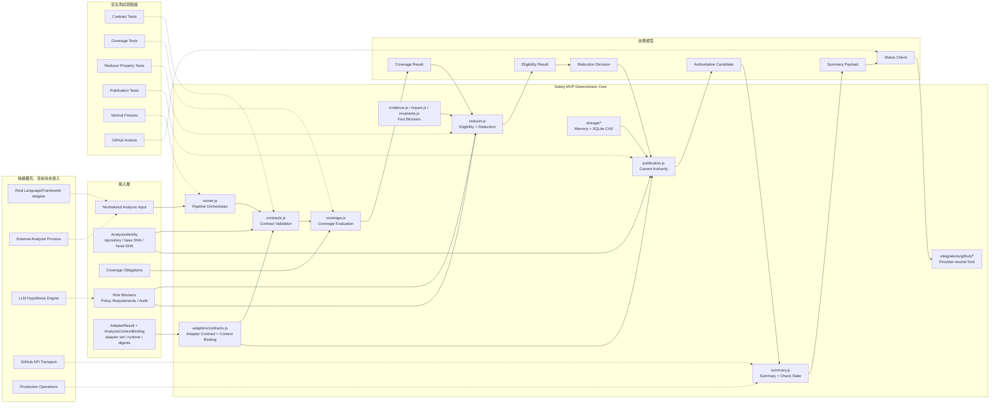
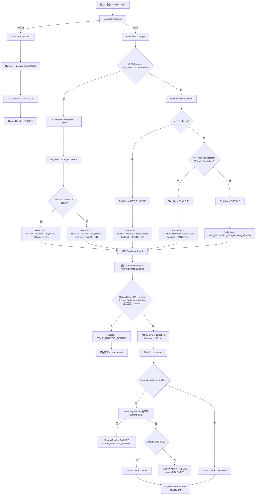
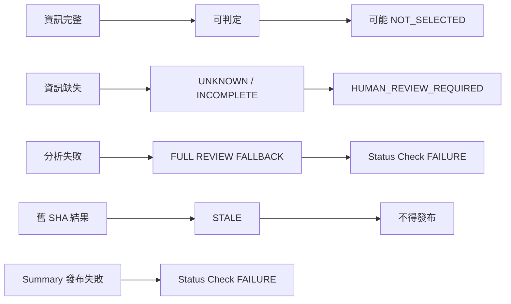

# Review Reduction Safety MVP 架構與流程

本文記錄目前第一版 Safety MVP 的模組架構、分析流程與安全邊界。

目前實作採 Node.js native ESM 與 `node:test`。N-01～N-07 的 deterministic safety boundary 已接通；尚未接入真實 Language/Framework Adapter、外部 Analyzer、LLM 或 GitHub API credential。

## 1. 系統架構



目前已實作的是 `Safety MVP Deterministic Core`、N-01～N-03 Adapter boundary、N-04 fact blocker pipeline、N-05 memory/SQLite CAS authority、N-06 provider-neutral GitHub sink 與 N-07 deterministic E2E/release gate。真實外部 Adapter、Analyzer、LLM、GitHub API transport 屬於未接入的外部實作，不是目前的 reduction authority 來源。

## 2. 執行流程



## 3. 安全決策邊界



## 4. 核心安全規則

1. `NOT_SELECTED_FOR_HUMAN_REVIEW` 只能由完整且有效的分析結果產生。
2. Required coverage 只有在所有 obligations 都是 `COMPLETE` 時，才可進入 reduction eligibility。
3. `PARTIAL_PARSE`、unsupported adapter、unknown runtime、timeout、truncation 或 analyzer failure 都不能被當成「沒有風險」。
4. `ANALYSIS_FAILED` 必須回退 Full Review，且 Status Check 不得為成功。
5. Eligibility blocker 只能增加或保留，Reducer 不得刪除或覆蓋 blocker。
6. 新 head SHA 會立即使舊 authoritative result 失效。
7. 舊 run 即使晚完成，也不得覆寫較新的 current result。
8. Candidate、Summary、Status Check 必須使用同一份 `AnalysisIdentity`，以及存在時的 `AnalysisContextBinding`。
9. Summary 發布失敗、遺失或 SHA 不一致時，Status Check 必須失敗。
10. AdapterResult 或 authority context 缺漏、格式錯誤、digest 不一致或 runtime/adapter 不一致時，必須 fail-closed，不得發布候選結果。
11. Evidence、impact、invariant unresolved facts 只能增加 reducer blocker，不能導向 `NOT_SELECTED_FOR_HUMAN_REVIEW`。
12. GitHub sink failure 只能是 delivery failure，不得改寫 authority、candidate 或安全 check。

## 5. 目前實作對照

| 模組 | 檔案 | 責任 |
|---|---|---|
| Contract | `src/contracts.js` | Identity、coverage、eligibility、decision validation |
| Adapter Contract | `src/adapters/contracts.js` | AdapterSet、AdapterResult、runtime context、canonical digest、AnalysisContextBinding |
| Adapter Normalization | `src/adapters/normalize.js` | Changed-region sorting、terminal status mapping、AdapterResult ingress |
| Reference Adapter | `src/adapters/reference-adapter.js` | Deterministic fixture adapter；不實作 parser |
| Adapter Execution | `src/adapters/runner.js`, `src/adapters/errors.js` | Deadline、AbortSignal、exception、malformed output、late-result fail-closed boundary |
| Coverage | `src/coverage.js` | Required obligation 與 changed-region fail-closed 判斷 |
| Reducer | `src/reducer.js` | Eligibility 聚合與 Human Review scope 決策 |
| Fact Blockers | `src/evidence.js`, `src/impact.js`, `src/invariants.js` | Provenance、impact edge、invariant mapping 的 unresolved blocker |
| Runner | `src/runner.js` | 串接完整 deterministic pipeline |
| Publication | `src/publication.js` | Current head、stale-run、atomic authority |
| Authority Storage | `src/storage/*` | Memory/SQLite persisted head、candidate 與 CAS |
| Summary | `src/summary.js` | Summary payload 與 status check state 的 identity/context binding |
| GitHub Sink | `src/integrations/github/*` | Provider-neutral Summary/check upsert 與 delivery failure |
| Fixtures | `fixtures/safety-mvp/` | AdapterResult、Human Review / NOT_SELECTED 情境 |
| Tests | `tests/`, `fixtures/e2e/` | Contract、property、storage、sink、vertical、full E2E validation |

## 6. 後續接入方向

```text
Executable Language / Framework Adapter
        ↓
AdapterResult + AnalysisContextBinding
        ↓
Normalized Facts / Changed Regions
        ↓
Impact Graph / Risk / Invariant / Evidence
        ↓
Safety MVP Reducer
        ↓
ReviewUnit / GitHub Summary / Merge Gate
```

後續可執行 Adapter 必須遵守 N-01 contract 與目前的安全邊界：只要不能完整描述 changed region 或 execution context，就輸出 incomplete / unknown，讓既有 Reducer 保留 Human Review，而不是自行宣告安全。N-04～N-07 已提供 facts、CAS、sink 與 E2E 的 production seams；真實外部 Adapter 與 GitHub API 仍需另行接入與驗證。
