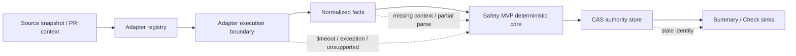

# Review Reduction Next Phase Design

## 目標

將目前已完成的 deterministic Safety MVP，先安全接上 Adapter ingress；後續再以 gated follow-up 接入 evidence/impact、持久化 authority 與 GitHub sink。任何新邊界都必須維持目前的 fail-closed 語意，不能因為接入真實來源而讓不完整輸入變成 `NOT_SELECTED_FOR_HUMAN_REVIEW`。

本文件是分階段 roadmap；本次實作依相依性完成 N-04～N-07。N-04～N-07 必須分別在前置 contract、fixtures、coverage 與 adapter-to-core acceptance 完成後個別開工。

## 現況與問題邊界

目前 `src/runner.js` 接受已 normalized 的 analysis input，經過 contracts、coverage、reducer、publication、summary 後產生結果。這個核心已具備 deterministic 測試、stale identity protection、atomic in-memory publication 與 status binding，但仍缺少以下 production seam：

- 外部 Language / Framework Adapter 的輸入輸出契約。
- mixed-language changed region 的 ownership 與 runtime context 正規化。
- adapter timeout、exception、unsupported capability 的統一處理。
- evidence、impact、invariant 結果如何進入 blocker aggregation。
- process restart 後仍可驗證 current authority 的 storage boundary。
- GitHub Summary、status check 與 idempotent retry 的外部發布邊界。

## 設計原則

1. Adapter 只產生 facts 與 coverage evidence，不得直接產生 reduction decision。
2. 所有 Adapter output 必須經過一個 normalization boundary 才能進入 `runSafetyMvp()`。
3. 缺少 path、language、adapter、runtime、execution context、evidence 或 identity 時，輸出 incomplete / failed blocker。
4. `unknown` runtime 即使有 diagnostic 也永遠不是 reduction evidence；它必須保留為 blocker。
5. 既有六欄 `AnalysisIdentity` 保持 repository、base SHA、head SHA、policy 與 runner 語意；Adapter set 與 region runtime 以 `AnalysisContextBinding` 綁定，不使用單一 adapter 假設。
6. Impact graph 與 invariant mapper 只能增加 blocker，不能移除 coverage 或 risk blocker。
7. Publication 使用 compare-and-swap（CAS）或等價 transaction boundary；stale run 必須是 no-op。
8. 外部 GitHub integration 是 sink，不得反過來改寫 authoritative decision。
9. deterministic core 測試不得依賴網路、LLM、真正 parser process 或 GitHub API。

## 目標架構



### Boundary A：Adapter contract

新增 `AdapterSet`、`AdapterRequest`、`AdapterResult`、`ChangedRegion` 與 `RegionRuntimeContext`。Adapter result 必須描述：

- 一組 adapter id/version、supported languages 與 capabilities；
- 每個 changed region 的 byte range、language owner、adapter id 與 region-level runtime context；
- 每個 required obligation 的 terminal status：`COMPLETE`、`PARTIAL_PARSE`、`UNSUPPORTED`、`TIMEOUT`、`TRUNCATED` 或 `FAILED`；
- diagnostics 與 evidence references；
- result 是否完整，以及不完整的 stable reason code。

Adapter 不得回傳 `ELIGIBLE`、`NOT_ELIGIBLE` 或 reduction decision。

N-01 的可執行 contract 固定為：

```js
{
  adapterSet: [{
    id,
    version,
    languages: [],
    capabilities: []
  }],
  obligations: [{
    id,
    required,
    status,
    changedRegions: []
  }],
  diagnostics: [],
  evidenceReferences: [],
  complete,
  reasonCode
}
```

`languages`、`capabilities`、`diagnostics` 與 `evidenceReferences` 的元素都必須是非空且不重複的字串；其中 diagnostics 與 evidence references 可以是空集合。第一版 capability 只允許 `changed-regions`、`runtime-context`、`coverage-obligations`、`evidence-references`，未知 capability 必須拒絕。N-01 只把 evidence reference 視為 opaque stable id，evidence item schema 仍由 N-04 負責。

`complete: false` 必須帶 stable `reasonCode`；`complete: true` 不得帶 incomplete reason，且所有 required obligation 都必須是 `COMPLETE`。required `COMPLETE` obligation 至少要有一個合法 changed region。Adapter 宣告的 region language 必須包含在對應 Adapter descriptor 的 `languages` 中。

Adapter 自己回報的 obligation `TIMEOUT` 與 runner 執行 deadline timeout 是兩種不同事件：前者是合法但不完整的 coverage terminal status；後者代表 adapter execution 沒有在 deadline 內交付可信 result，必須進入 `ANALYSIS_FAILED`。

### Boundary B：Runtime context 與 context binding

將目前 region 上的簡單 runtime string 擴充為可 canonicalize 的 region-level context：

```js
{
  namespace: 'server',
  id: 'server:api',
  version: 'node-24',
  source: 'adapter'
}
```

`namespace` 只允許 `server`、`client`、`edge`、`worker`、`external`、`unknown`。`unknown`、缺少 `id` 或缺少 region context 都會產生 blocker；`unknown` 永遠不能讓 coverage 變成 `COMPLETE`。

`AnalysisContextBinding` 定義如下：

```js
{
  adapterSet: '<canonical adapter descriptors>',
  adapterSetDigest: '<canonical adapter set digest>',
  executionContextDigest: '<canonical region context digest>',
  regions: '<canonical changed regions>'
}
```

canonical source data 隨 binding 保留，讓 candidate、authority 與 Summary 都能重算 digest，不接受 Adapter 自行宣稱。`adapterSetDigest` 固定包含所有 adapter id/version；`executionContextDigest` 固定包含所有 region path、byte range、language、adapter id 與 runtime context。排序使用與 locale 無關的 deterministic bytewise string order。合法 incomplete result 可以沒有 regions，此時 execution context 是 canonical 空集合。

### Boundary C：Evidence / impact / invariant

Adapter facts 先進入 normalized evidence，再由純函式產生 impact 與 invariant blockers。N-04 開工前必須固定以下 evidence schema：

```js
{
  id: 'EVIDENCE-001',
  source: 'adapter:blade-v1',
  subject: 'entity:payment-service',
  kind: 'CALL_EDGE',
  complete: true,
  provenance: {
    path: 'src/payment.js',
    startByte: 0,
    endByte: 10
  }
}
```

`requiredSubjects` 與 `requiredInvariants` 必須由 `policyId + policyVersion` 決定，不由 Adapter 自行擴張；Adapter 只能提供 facts 與 provenance。

規則如下：

- evidence 必須有 stable id、source、subject 與 completeness；
- impact edge 必須標示 provenance；無法解析的 edge 轉成 `IMPACT_EDGE_UNRESOLVED`；
- invariant mapping 找不到 required invariant 轉成 `INVARIANT_MAPPING_MISSING`；
- 所有 unresolved 狀態只會增加 blocker，不會使 eligibility 變成 `ELIGIBLE`。

第一版不引入機率分數、第二套 entity graph 或 LLM 判定。只處理可驗證的 normalized facts。

### Boundary D：Authority storage

保留 `publication.js` 的 pure candidate validation，新增 storage port：

```js
{
  readCurrentHead(repository),
  readCurrent(repository),
  advanceCurrentHead({ repository, expectedHead, nextHead }),
  compareAndSwapCurrent({ repository, expectedHead, candidate })
}
```

`advanceCurrentHead()` 必須在同一 transaction 驗證 expected head、更新 current head 並清除舊 candidate；`compareAndSwapCurrent()` 必須以 persisted current head 為條件。SQLite 實作使用 transaction、唯一 repository key 與 identity digest。CAS 失敗回傳 `STALE_ANALYSIS_IDENTITY`，不可修改既有 current result。in-memory store 仍保留給 unit tests。

### Boundary E：External publication

GitHub publisher 只接受已驗證的 authoritative Summary 與 check state。先定義 provider-neutral `upsertSummary` / `upsertCheck` port，再由 GitHub adapter 使用 head SHA、candidate digest 與固定 marker 找到既有 publication；不假設 GitHub API 原生支援任意 idempotency key。任何 API timeout、非 2xx、payload mismatch 或 retry ambiguity 都回傳 publication failure，不改變 authoritative decision。

## 交付階段與依賴

| 階段 | 交付 | 依賴 |
|---|---|---|
| N-01 | Adapter set、region runtime context、identity binding contract | Safety MVP 已完成 |
| N-02 | mixed-language normalization 與 reference adapter | N-01 |
| N-03 | adapter execution timeout / exception boundary | N-01、N-02 |
| N-04 | evidence contract、policy requirements、impact/invariant reducer inputs | N-02、N-03 |
| N-05 | SQLite authority store 與 atomic head transition | N-01、N-03 |
| N-06 | provider-neutral publication port 與 GitHub adapter | N-05 |
| N-07 | full E2E、observability、CI release gate、操作文件 | N-03、N-05、N-06 |

N-04～N-07 是依相依性 gated tasks，每個階段都必須先寫 failing tests，再寫最小實作，並通過 `npm run lint`、遞迴 `npm run test:safety` 與 `npm run test:coverage`。遞迴 test discovery 的正式命令固定為 `node --test`；Node.js 24.3.0 不接受 `tests` 目錄作為輸入，不得以 glob 只執行 root-level test files。

## 測試策略

除既有 Safety MVP 測試策略外，新增四類案例：

- Adapter contract：合法 output、每個欄位缺失、錯誤型別、未知 capability、unknown runtime。
- Execution boundary：正常完成、adapter-declared timeout、execution deadline timeout、throw、malformed result、abort 後 late result；前者必須是 `INCOMPLETE/HUMAN_REVIEW_REQUIRED`，後者必須是 `ANALYSIS_FAILED/FULL/FAILURE`。
- Storage / external sink：CAS 成功、CAS stale、重啟讀回、重試 idempotency、外部發布失敗。
- Vertical / E2E：mixed-language 完成、單一 language partial、runtime 缺失、evidence unresolved、new head、old run late completion、GitHub sink failure。

所有測試必須維持正向、反向、邊界與整合四面檢查；不以高 coverage 取代安全不變量。

## 本階段明確不做

- 完整 PHP/Laravel、Blade/Vue/JSX parser implementation。
- 真正的 LLM hypothesis generation。
- Cross-repository assurance 與 merge queue。
- 分散式 lock service 或高負載效能優化。
- 允許 external sink 反向決定 reduction eligibility。
- 真實 parser、GitHub API、production database credential 與 external process 不列入 deterministic MVP；N-04～N-07 使用純函式、SQLite temporary database 與 injected fake transport 完成可驗證的安全邊界。
- Adapter execution boundary 是 trusted in-process boundary，不是 sandbox；不在 N-01～N-03 宣稱已隔離任意不受信任程式碼。

## Stable failure codes

第一批與後續階段共用下列可觀測 failure code，不能以單一 `FAILED` 取代：

```text
ADAPTER_EXECUTION_TIMEOUT
ADAPTER_EXCEPTION
ADAPTER_RESULT_INVALID
ADAPTER_ABORTED
AUTHORITY_CAS_STALE
AUTHORITY_CAS_CONFLICT
GITHUB_PUBLICATION_FAILED
```
